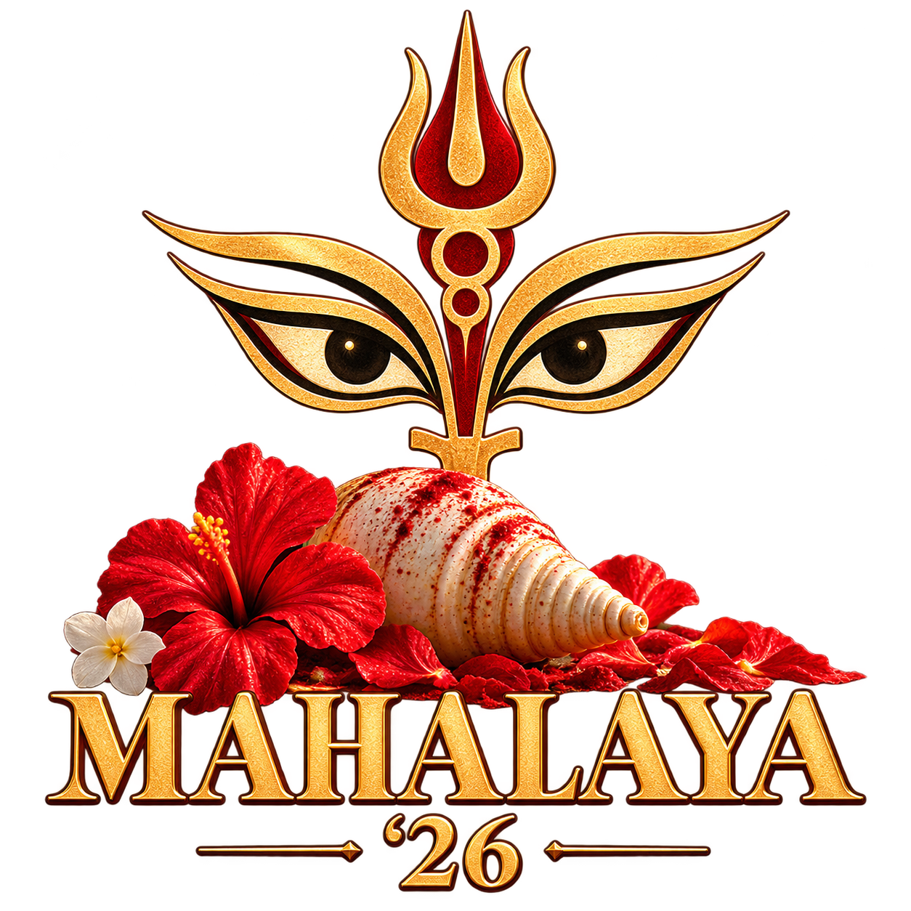
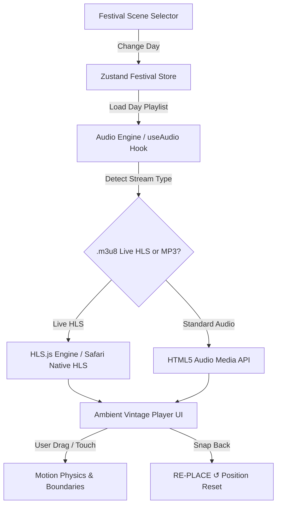

<div align="center">

  

  # 🌺 Mahalaya '26 — A Bengali Festival Memory

  *An immersive, audiovisual digital installation honoring the spirit, soundscapes, and timeless nostalgia of Mahalaya and Durga Puja in Bengal.*

  [**Live Experience — mahalaya26.vercel.app**](https://mahalaya26.vercel.app)

  <br />

  [](https://mahalaya26.vercel.app)
  [](https://nextjs.org/)
  [](https://react.dev/)
  [](https://tailwindcss.com/)
  [](https://www.typescriptlang.org/)
  [](LICENSE)

</div>

---

## 📖 Overview

**Mahalaya '26** is a web-based ambient tribute to Durga Puja. It captures the atmosphere of watching Bengal's biggest cultural and spiritual festival unfold from a Kolkata balcony—from the crackling 4 AM radio broadcast of Birendra Krishna Bhadra on Mahalaya morning to the bittersweet farewell of Dashami and the warm reunions of Subho Bijoya.

The application blends high-resolution responsive artwork, atmospheric particle effects (morning mist, diya glow, vermilion dust, falling petals), interactive timeline navigation, and an authentic **vintage transistor radio player** streaming live All India Radio stations and canonical festive music.

---

## 📻 Vintage Radio Player & Audio Engine

The heart of the application is a fully interactive, draggable vintage solid-state transistor radio player (`PUJA RADIO · AKASHVANI KOLKATA`).



### Key Player Features
- **📻 Live Akashvani & Kolkata FM Channels**:
  - **Akashvani Kolkata Geetanjali** (AIR AM 1008 — Primary Bengali Channel)
  - **Akashvani FM Rainbow Kolkata** (107.0 FM — Music & Cultural Broadcasts)
  - **AIR FM Gold Kolkata** (100.1 FM — Golden Classics & Commentary)
  - **Mellow Bangla Live** (24/7 Festive Stream)
- **🎶 Day-Specific Canonical Playlists**:
  - Dedicated tracks for each festival day—from Birendra Krishna Bhadra's complete 1931 *Mahishasura Mardini* broadcast to Agomoni songs (*Agomoni Aalo* by Jayati Chakraborty), traditional Dhak beats (*Bodhon*, *Kola Bou Snan*, *Sandhi Puja 108 Pradip*, *Dhunuchi Naach*, *Bisarjan*), Ashtami *Pushpanjali* (*Argala Stotram*), and nostalgic Rabindrasangeet.
- **🏷️ Clear UX & No Misleading FM Labels**:
  - Quick-tune station/song pills with clear category icons (`📻 Live Radio`, `🎵 Puja Song`, `🥁 Dhak Beats`, `🕉️ Sacred Chant`). Dedicated tracks are clearly labeled with their actual titles instead of fake FM frequencies.
- **🎛️ Illuminated Frequency Tuning Dial**:
  - Warm amber backlit dial scale with a glowing red illuminated needle. Click anywhere along the frequency dial to switch stations or seek recorded audio.
- **🖐️ Draggable Physics & `RE-PLACE ↺` Snap Button**:
  - Drag the radio anywhere across the screen on desktop or mobile. Tap **RE-PLACE ↺** at any time to smoothly animate the radio back to its resting position in the bottom-right corner.

---

## 🗓️ The 9-Day Festival Journey

| Scene | Festival Day | Subtitle | Key Atmosphere & Visuals | Audio Lineup |
| :--- | :--- | :--- | :--- | :--- |
| **I** | **Mahalaya** | *The Awakening* | Morning mist, shiuli flowers, sunrise gold | Akashvani Geetanjali Live, AIR 107 FM, Birendra Krishna Bhadra (1931), Aigiri Nandini |
| **II** | **Tritiya** | *The Anticipation* | Bamboo scaffolds, pandal lights, ambient dust | Agomoni Aalo (Jayati Chakraborty), Agomoni Geet, Mellow Bangla Live |
| **III** | **Panchami** | *The Arrival* | Idol unveilings, evening lights, golden glow | Durga Durgatinashini, Pujo Elo Re, AIR FM Rainbow Kolkata |
| **IV** | **Shashthi** | *The Welcome* | Bodhon under bel tree, twilight incense | Shashthi Bodhon Dhak Beats, Saptashloki Durga Chants, Agomoni Aalo |
| **V** | **Saptami** | *The Invocation* | Nabapatrika snan at dawn, sacred riverbank | Kola Bou Snan Dhak Beats, Durga Manas Puja, AIR FM Rainbow |
| **VI** | **Ashtami** | *The Devotion* | 108 lamps, lotus offerings, diya flames | Argala Stotram (Pushpanjali Mantra), Sandhi Puja 108 Pradip Dhak, Mahishasur Mardini Stotram |
| **VII** | **Nabami** | *The Celebration* | Dhunuchi naach frenzy, camphor smoke, red petals | Dhunuchi Naach & Aarti Dhak Beats, Durga Durgatinashini, Mellow Bangla |
| **VIII** | **Dashami** | *The Farewell* | Sindoor khela, immersion tears, vermilion haze | Bisarjan Dhak (Asche Bochor Abar Hobe), Srabono Dharaye Elo Ratri, Kshama Prarthana |
| **IX** | **Ekadashi** | *The Aftermath* | Quiet streets, sweet boxes, cool morning mist | Subho Bijoya Sitar & Tagore Melodies, Mellow Bangla Bijoya Special, Akashvani Live |

---

## 💻 Tech Stack

- **Framework**: [Next.js 15.2](https://nextjs.org/) (App Router, Server Components & Static Site Generation)
- **UI & React**: [React 19](https://react.dev/) & [TypeScript 5](https://www.typescriptlang.org/)
- **Styling**: [Tailwind CSS v4](https://tailwindcss.com/) with PostCSS & custom glassmorphism design tokens
- **Animation & Physics**: [Motion 12](https://motion.dev/) (Motion for React — drag constraints, spring physics, layout animations)
- **State Management**: [Zustand 5](https://zustand-demo.pmnd.rs/) (Centralized festival state & audio store)
- **Audio Engine**: [HLS.js 1.7](https://github.com/video-dev/hls.js/) + HTML5 Web Audio API (Native Safari HLS fallback + cross-browser `.m3u8` live streaming)
- **Icons**: [Lucide React](https://lucide.dev/)
- **Image Optimization**: WebP responsive image pyramids (480p, 768p, 1280p, original)

---

## 🛠️ Getting Started

### Prerequisites
- **Node.js**: v18.17.0 or higher
- **npm**: v9.0.0 or higher

### Installation

1. **Clone the repository**:
   ```bash
   git clone https://github.com/soumyadeepsarkar-2004/mahalaya26.git
   cd mahalaya26
   ```

2. **Install dependencies**:
   ```bash
   npm install
   ```

3. **Run the development server**:
   ```bash
   npm run dev
   ```

4. Open [http://localhost:3000](http://localhost:3000) in your browser.

---

## 📦 Build & Deployment

To create an optimized production build:

```bash
npm run build
npm run start
```

### Vercel Deployment
This repository is pre-configured for instant deployment on [Vercel](https://vercel.com/):

```bash
npx vercel deploy --prod
```

---

## 👤 Author & Credits

- **Design & Curation**: **Soumyadeep** ([@soumyadeepsarkar-2004](https://github.com/soumyadeepsarkar-2004))
- **Audio Archives & Live Streams**: Prasar Bharati (All India Radio Akashvani Kolkata), Saregama, and Archive.org.
- **Artwork & Photography**: Curated Durga Puja archival imagery.

---

<div align="center">

  **Shubho Mahalaya & Shubho Sharadiya!** 🌺  
  *Asche Bochor Abar Hobe!*

</div>
